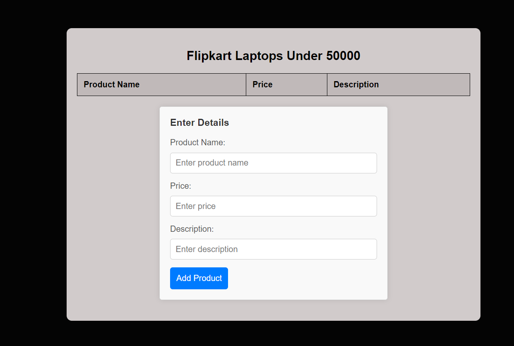

# Flipkart Laptops Under 50000

This project scrapes data from Flipkart's website to retrieve information about laptops under 50000 INR. It includes a Python script for web scraping and an HTML file to display the scraped data.

## Python Script (`webscrapper.py`)

The Python script `webscrapper.py` uses the `requests` and `BeautifulSoup` libraries to scrape data from Flipkart. It extracts information such as product names, prices, and descriptions for laptops under 50000 INR.

To run the script, make sure you have Python installed, and install the required libraries using:


pip install requests beautifulsoup4 pandas


Then, execute the script:

python webscrapper.py

The scraped data will be saved to a CSV file named `flipkart_laptops_under_50000.csv`.

## HTML File (`webscraper.html`)

The HTML file `webscraper.html` provides a user-friendly interface to view the scraped data. It displays a table with columns for product name, price, and description. Additionally, it includes a dialog box for users to input additional laptop details.

To view the HTML file, simply open it in a web browser.

## Preview



## License

This project is licensed under the MIT License. See the [LICENSE](LICENSE) file for details.
```
